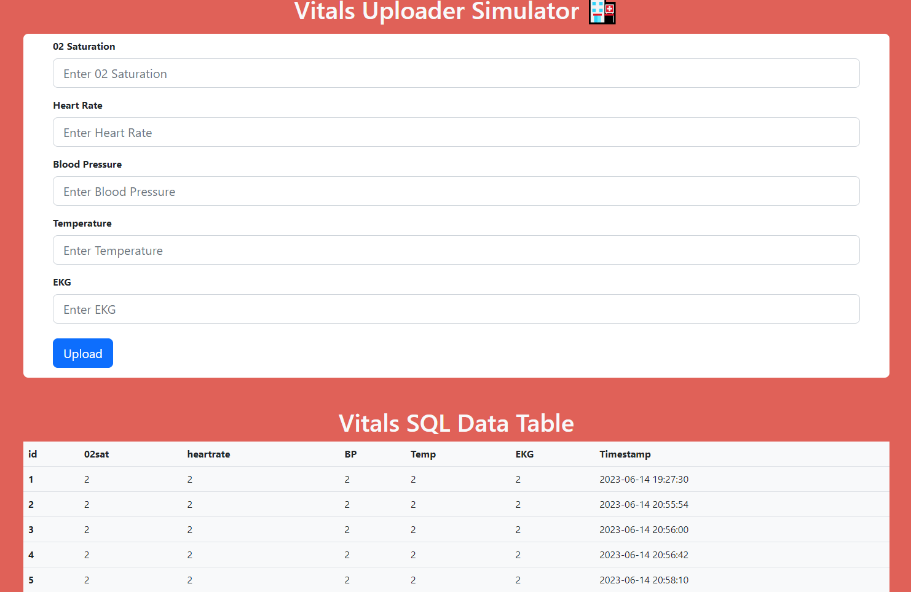
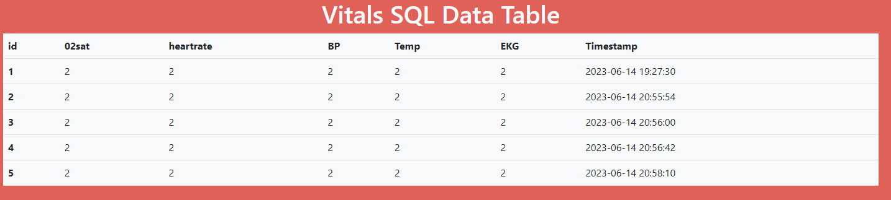

# Vitals Collection Simulator

## Purpose: Used to quickly upload vitals to the telemed database for testing and development purposes

## Prototype: Demonstrates a prototype of the pairing process

 

